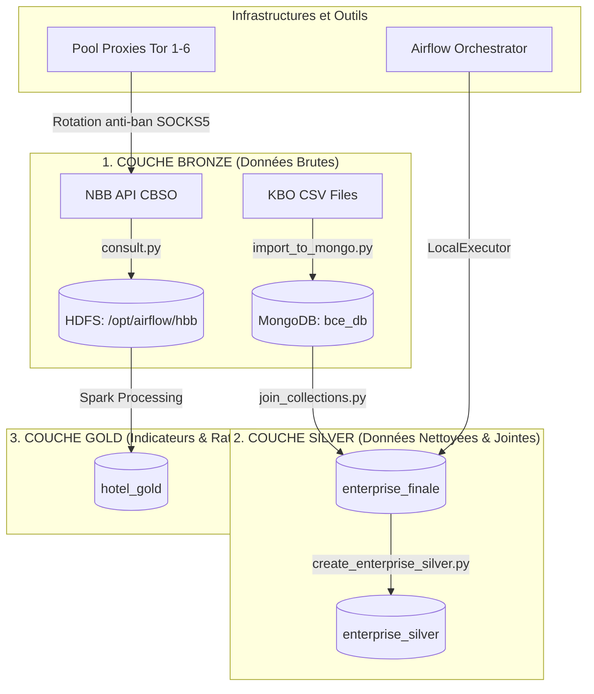

# Pipeline BCE Big Data & Ingestion Hotellerie

🔗 **Repository GitHub** : [talmodovar/ALMODOVAR_Scraping_Hotellerie](https://github.com/talmodovar/ALMODOVAR_Scraping_Hotellerie)

Ce projet met en place un pipeline de données Big Data conteneurisé sous Docker pour ingérer, nettoyer, croiser et analyser les données d'entreprises de la BCE (Banque-Carrefour des Entreprises) ainsi que les dépôts financiers de la Banque Nationale de Belgique (NBB) sur le secteur hôtelier.

---

## 🏗️ Architecture du Projet

Le projet implémente une architecture de données en couches (**Bronze / Silver / Gold**) :



### 1. Couche Bronze
*   **MongoDB (`bce_db`)** : Ingestion brute des fichiers CSV (collections : `enterprise`, `activity`, `address`, `branch`, `contact`, `denomination`, `establishment`, `code`, `meta`).
*   **HDFS (Hadoop 3.2)** : Stockage des fichiers de bilans financiers bruts au format PCMN CSV téléchargés depuis l'API de la NBB sous l'arborescence `/{bce}/hbb/filing_ref.csv`.

### 2. Couche Silver
*   **`enterprise_finale`** : Regroupement et jointure à plat de toutes les collections Bronze par numéro unique d'entreprise (`EnterpriseNumber` ou `EntityNumber`).
*   **`enterprise_silver`** : Collection nettoyée et normalisée selon les règles métier :
    *   Normalisation des dates au format standard `YYYY-MM-DD`.
    *   Dédoublonnage des activités NACE (clé unique `NaceCode` + `Classification`).
    *   Filtre d'adresse unique (conservation uniquement du siège social enregistré `TypeOfAddress = REGO`).
    *   Tri des dénominations pour placer le nom officiel (`TypeOfDenomination = 1`) en premier.
    *   Traduction et décodage dynamique en français (`JuridicalFormLabel`, `StatusLabel`, `NaceLabel`).

### 3. Couche Gold
*   **`hotel_gold`** : Collection Spark stockant les exercices comptables par entreprise avec calcul automatique des indicateurs clés (CA, Marge brute, Marge nette, ROE, Liquidité, Taux d'endettement) prêts pour affichage graphique (Sankey, tableaux).

---

## 🛠️ Services de l'Infrastructure (Docker Compose)

L'architecture est entièrement conteneurisée via le fichier [docker-compose.yml](file:///c:/Users/Thomas/Documents/IPSSI/Architecture%20data/Travail%20%C3%A0%20rendre/ALMODOVAR_PROJET/docker-compose.yml) :

| Service Docker | Rôle / Description | Ports Exposés (Hôte -> Conteneur) |
| :--- | :--- | :--- |
| **`bce_mongo`** | Base de données principale pour les données structurées KBO et Silver. | `27019:27017` *(Évite le conflit avec un Mongo local)* |
| **`bce_mongo_state`** | State DB isolée pour tracker l'état du scraping (évite de ré-ingérer l'historique en cas de crash). | `27018:27017` |
| **`mongo_express`** | Interface Web d'administration de MongoDB. | `8081:8081` (Admin: `admin`/`admin`) |
| **`hdfs_namenode`** | Point d'entrée de stockage HDFS (NameNode). | `9870:9870` / `9000:9000` |
| **`hdfs_datanode`** | Stockage physique des blocs de fichiers HDFS (DataNode). | `9864:9864` / `9866:9866` |
| **`tor1` à `tor6`** | Pool de proxies SOCKS5 Tor rotatifs (protection contre le blocage HTTP 429 par l'API). | `9050` à `9061` |
| **`airflow_postgres`** | Base PostgreSQL pour les métadonnées d'Airflow. | *Interne au réseau Docker* |
| **`airflow_scheduler`** | Planificateur et moteur d'exécution des DAGs. | *Interne au réseau Docker* |
| **`airflow_webserver`** | Interface d'administration Web d'Airflow. | `8082:8080` *(Évite le conflit avec le port 8080)* |

---

## 🚀 Procédure de Démarrage

> **Pré-requis** : Docker Desktop (WSL2), Node.js 18+, Python 3.10+

---

### Étape 1 — Lancer Docker Desktop

Sur Windows, Docker Desktop doit être **démarré avant toute commande `docker`**.

```powershell
# Lancer Docker Desktop (si ce n'est pas déjà fait)
Start-Process "C:\Program Files\Docker\Docker\Docker Desktop.exe"

# Attendre que le moteur WSL2 soit prêt (~30-60s)
Start-Sleep -Seconds 30
docker info
```

Attendez que l'icône Docker dans la barre des tâches soit **verte** (moteur prêt), puis vérifiez :

```powershell
docker info
```

---

### Étape 2 — Démarrer tous les services (Backend + Infra)

Depuis la racine du projet :

```powershell
# Premier démarrage (build des images) :
docker-compose up -d --build

# Redémarrages suivants (plus rapide, sans rebuild) :
docker-compose up -d

# Redémarrage complet avec reconstruction forcée (après modification du code backend) :
docker-compose up -d --build --force-recreate backend
```

> **Temps estimé** : ~2-5 min au premier démarrage (téléchargement des images Hadoop, Mongo, Airflow).

Vérifiez que tous les conteneurs sont bien démarrés :

```powershell
docker-compose ps
```

Vous devriez voir tous les services en état `running` ou `healthy`.

---

### Étape 3 — Démarrer le Frontend (React/Vite)

Le frontend tourne **en local** (hors Docker). Ouvrez un **nouveau terminal** et lancez :

```powershell
cd frontend
npm install          # uniquement au premier démarrage
npm run dev
```

Le frontend sera disponible sur → **[http://localhost:5173](http://localhost:5173)**

---

### Étape 4 — Vérifier que tout fonctionne

| Service | URL | Vérification |
| :--- | :--- | :--- |
| **Frontend** | [http://localhost:5173](http://localhost:5173) | Dashboard React visible |
| **Backend API** | [http://localhost:8000](http://localhost:8000) | Réponse `{"status":"ok"}` |
| **Swagger Docs** | [http://localhost:8000/docs](http://localhost:8000/docs) | Documentation interactive |
| **Mongo Express** | [http://localhost:8081](http://localhost:8081) | UI MongoDB (`admin`/`admin`) |
| **Airflow** | [http://localhost:8082](http://localhost:8082) | Orchestrateur (`admin`/`admin`) |
| **HDFS NameNode** | [http://localhost:9870](http://localhost:9870) | Interface Hadoop |

---

### Commandes utiles

```powershell
# Voir les logs d'un service (ex: backend)
docker-compose logs -f backend

# Voir les logs de tous les services
docker-compose logs -f

# Arrêter tous les services (sans supprimer les volumes)
docker-compose stop

# Arrêter et supprimer les conteneurs (données conservées dans les volumes)
docker-compose down

# Arrêter ET supprimer tous les volumes (reset complet — ATTENTION : perte de données)
docker-compose down -v
```

---

## 🗄️ Ingestion des données (Étape par Étape)

Une fois l'infrastructure démarrée, exécutez les scripts dans cet ordre pour peupler les couches Bronze → Silver → Gold.

### Étape A — Import CSV bruts (Bronze Layer)

Ce script lit les fichiers CSV dans `./data/` et les importe par blocs dans MongoDB (`bce_db`). Les collections déjà importées sont automatiquement ignorées.

```powershell
python "./ingestion/import_to_mongo.py"
```

### Étape B — Jointure à plat (Bronze → Unified)

Crée les index B-tree sur `EnterpriseNumber` / `EntityNumber`, puis effectue la jointure de toutes les collections vers `enterprise_finale` :

```powershell
python "./traitement_pour_mongo/join_collections.py"
```

### Étape C — Nettoyage Silver (Unified → Silver Layer)

Applique toutes les règles métier (normalisation dates, dédoublonnage NACE, filtrage adresses REGO, traduction française) et insère dans `enterprise_silver` :

```powershell
python "./Transformation/create_enterprise_silver.py"
```

### Étape D — Scraping financier NBB / CBSO

Scrape les comptes annuels depuis 2021 via le pool de proxies Tor rotatifs et injecte les fichiers dans HDFS (`/{bce}/hbb/{ref}.csv`) :

```powershell
# Exécuter dans le conteneur Airflow (dépendances SOCKS5/PySocks incluses)
docker exec -d airflow_scheduler python /opt/airflow/ingestion/consult.py
```

### Étape E — Scraping actes notariés

Scrape et télécharge les statuts PDF depuis `statuts.notaire.be` via Playwright avec rotation IP Tor. Les fichiers sont stockés dans `./tmp/notaire/` :

```powershell
# Exécuter depuis Windows hôte (Playwright/Chrome requis)
python "./ingestion/strapor.py"
```

---

## 🏗️ Architecture du Projet

Le projet implémente une architecture de données en couches (**Bronze / Silver / Gold**) :


### 1. Couche Bronze
*   **MongoDB (`bce_db`)** : Ingestion brute des fichiers CSV (collections : `enterprise`, `activity`, `address`, `branch`, `contact`, `denomination`, `establishment`, `code`, `meta`).
*   **HDFS (Hadoop 3.2)** : Stockage des fichiers de bilans financiers bruts au format PCMN CSV téléchargés depuis l'API de la NBB sous l'arborescence `/{bce}/hbb/filing_ref.csv`.

### 2. Couche Silver
*   **`enterprise_finale`** : Regroupement et jointure à plat de toutes les collections Bronze par numéro unique d'entreprise (`EnterpriseNumber` ou `EntityNumber`).
*   **`enterprise_silver`** : Collection nettoyée et normalisée selon les règles métier :
    *   Normalisation des dates au format standard `YYYY-MM-DD`.
    *   Dédoublonnage des activités NACE (clé unique `NaceCode` + `Classification`).
    *   Filtre d'adresse unique (conservation uniquement du siège social enregistré `TypeOfAddress = REGO`).
    *   Tri des dénominations pour placer le nom officiel (`TypeOfDenomination = 1`) en premier.
    *   Traduction et décodage dynamique en français (`JuridicalFormLabel`, `StatusLabel`, `NaceLabel`).

### 3. Couche Gold
*   **`hotel_gold`** : Collection Spark stockant les exercices comptables par entreprise avec calcul automatique des indicateurs clés (CA, Marge brute, Marge nette, ROE, Liquidité, Taux d'endettement) prêts pour affichage graphique (Sankey, tableaux).

---

## 🛠️ Services de l'Infrastructure (Docker Compose)

L'architecture est entièrement conteneurisée via le fichier [docker-compose.yml](docker-compose.yml) :

| Service Docker | Rôle / Description | Ports Exposés (Hôte → Conteneur) |
| :--- | :--- | :--- |
| **`bce_mongo`** | Base de données principale pour les données structurées KBO et Silver. | `27019:27017` *(Évite le conflit avec un Mongo local)* |
| **`bce_mongo_state`** | State DB isolée pour tracker l'état du scraping (évite de ré-ingérer l'historique en cas de crash). | `27018:27017` |
| **`mongo_express`** | Interface Web d'administration de MongoDB. | `8081:8081` (Admin: `admin`/`admin`) |
| **`hdfs_namenode`** | Point d'entrée de stockage HDFS (NameNode). | `9870:9870` / `9000:9000` |
| **`hdfs_datanode`** | Stockage physique des blocs de fichiers HDFS (DataNode). | `9864:9864` / `9866:9866` |
| **`tor1` à `tor6`** | Pool de proxies SOCKS5 Tor rotatifs (protection contre le blocage HTTP 429 par l'API). | `9050` à `9061` |
| **`airflow_postgres`** | Base PostgreSQL pour les métadonnées d'Airflow. | *Interne au réseau Docker* |
| **`airflow_scheduler`** | Planificateur et moteur d'exécution des DAGs. | *Interne au réseau Docker* |
| **`airflow_webserver`** | Interface d'administration Web d'Airflow. | `8082:8080` *(Évite le conflit avec le port 8080)* |
| **`bce_backend`** | API FastAPI exposant les données Silver/Gold et orchestrant le streaming SSE. | `8000:8000` |

---

## 🏨 Échantillon de 10 Hôtels (Couche Gold)

Voici la liste de 10 hôtels avec leur numéro BCE disponible dans la couche Gold :

1. **RESIDENTIE SINT-JORISHOF** - N° BCE : `0400.039.084`
2. **ELAIS IMMO** - N° BCE : `0400.116.387`
3. **HET ANKER** - N° BCE : `0400.793.706`
4. **KATSENBERG** - N° BCE : `0400.951.181`
5. **Le Lys Rouge** - N° BCE : `0401.144.092`
6. **Maison Internationale de Mons** - N° BCE : `0401.144.191`
7. **KALEO** - N° BCE : `0401.214.467`
8. **Storme fils** - N° BCE : `0401.259.801`
9. **Home Louis Mertens - Oeuvre de Don Bosco** - N° BCE : `0401.268.214`
10. **Hof van In** - N° BCE : `0401.325.424`
