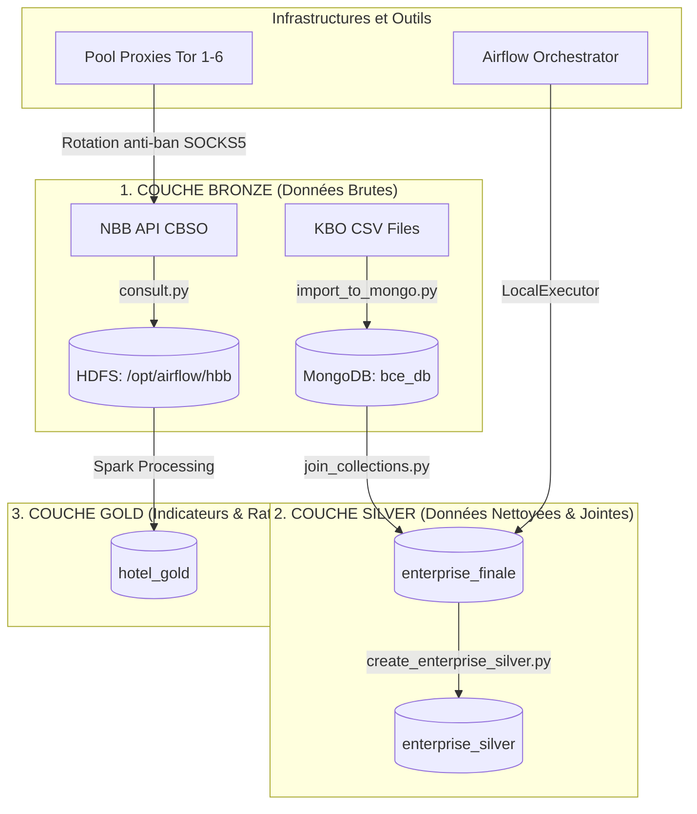

# Pipeline BCE Big Data & Ingestion Hotellerie

Ce projet met en place un pipeline de données Big Data conteneurisé sous Docker pour ingérer, nettoyer, croiser et analyser les données d'entreprises de la BCE (Banque-Carrefour des Entreprises) ainsi que les dépôts financiers de la Banque Nationale de Belgique (NBB) sur le secteur hôtelier.

---

## 🏗️ Architecture du Projet

Le projet implémente une architecture de données en couches (**Bronze / Silver / Gold**) :



### 1. Couche Bronze
*   **MongoDB (`bce_db`)** : Ingestion brute des fichiers CSV (collections : `enterprise`, `activity`, `address`, `branch`, `contact`, `denomination`, `establishment`, `code`, `meta`).
*   **HDFS (Hadoop 3.2)** : Stockage des fichiers de bilans financiers bruts au format PCMN CSV téléchargés depuis l'API de la NBB sous l'arborescence `/{bce}/hbb/filing_ref.csv`.

### 2. Couche Silver
*   **`enterprise_finale`** : Regroupement et jointure à plat de toutes les collections Bronze par numéro unique d'entreprise (`EnterpriseNumber` ou `EntityNumber`).
*   **`enterprise_silver`** : Collection nettoyée et normalisée selon les règles métier :
    *   Normalisation des dates au format standard `YYYY-MM-DD`.
    *   Dédoublonnage des activités NACE (clé unique `NaceCode` + `Classification`).
    *   Filtre d'adresse unique (conservation uniquement du siège social enregistré `TypeOfAddress = REGO`).
    *   Tri des dénominations pour placer le nom officiel (`TypeOfDenomination = 1`) en premier.
    *   Traduction et décodage dynamique en français (`JuridicalFormLabel`, `StatusLabel`, `NaceLabel`).

### 3. Couche Gold
*   **`hotel_gold`** : Collection Spark stockant les exercices comptables par entreprise avec calcul automatique des indicateurs clés (CA, Marge brute, Marge nette, ROE, Liquidité, Taux d'endettement) prêts pour affichage graphique (Sankey, tableaux).

---

## 🛠️ Services de l'Infrastructure (Docker Compose)

L'architecture est entièrement conteneurisée via le fichier [docker-compose.yml](file:///c:/Users/Thomas/Documents/IPSSI/Architecture%20data/Travail%20%C3%A0%20rendre/ALMODOVAR_PROJET/docker-compose.yml) :

| Service Docker | Rôle / Description | Ports Exposés (Hôte -> Conteneur) |
| :--- | :--- | :--- |
| **`bce_mongo`** | Base de données principale pour les données structurées KBO et Silver. | `27019:27017` *(Évite le conflit avec un Mongo local)* |
| **`bce_mongo_state`** | State DB isolée pour tracker l'état du scraping (évite de ré-ingérer l'historique en cas de crash). | `27018:27017` |
| **`mongo_express`** | Interface Web d'administration de MongoDB. | `8081:8081` (Admin: `admin`/`admin`) |
| **`hdfs_namenode`** | Point d'entrée de stockage HDFS (NameNode). | `9870:9870` / `9000:9000` |
| **`hdfs_datanode`** | Stockage physique des blocs de fichiers HDFS (DataNode). | `9864:9864` / `9866:9866` |
| **`tor1` à `tor6`** | Pool de proxies SOCKS5 Tor rotatifs (protection contre le blocage HTTP 429 par l'API). | `9050` à `9061` |
| **`airflow_postgres`** | Base PostgreSQL pour les métadonnées d'Airflow. | *Interne au réseau Docker* |
| **`airflow_scheduler`** | Planificateur et moteur d'exécution des DAGs. | *Interne au réseau Docker* |
| **`airflow_webserver`** | Interface d'administration Web d'Airflow. | `8082:8080` *(Évite le conflit avec le port 8080)* |

---

## 🚀 Guide de Démarrage et Ingestion

### 1. Prérequis
Assurez-vous d'avoir installé sur votre machine :
*   **Docker Desktop** (avec le moteur WSL2 activé sur Windows)
*   **Python 3.10+** (avec les packages `pymongo` et `pandas` pour l'ingestion locale)

### 2. Démarrage de l'Infrastructure
Positionnez-vous dans le répertoire racine du projet et démarrez les conteneurs en tâche de fond :
```powershell
docker compose up -d
```
*Note : Si les images ne sont pas installées, Docker va automatiquement les télécharger puis initialiser le cluster Hadoop et la base Airflow.*

### 3. Ingestion des données (Étape par Étape)

Les scripts d'ingestion et de transformation peuvent être exécutés directement depuis votre hôte Windows (grâce au port mappé `27019` pour MongoDB) ou à l'intérieur du conteneur.

#### Étape A : Import des fichiers CSV bruts (Bronze Layer)
Ce script lit les fichiers CSV situés dans le dossier `./data` et les importe par blocs dans MongoDB. Il détecte et passe automatiquement les collections déjà importées pour gagner du temps :
```powershell
python "./ingestion/import_to_mongo.py"
```

#### Étape B : Création des index et jointure à plat (Bronze -> Unified)
Ce script crée les index B-tree nécessaires sur les clés de jointure (`EnterpriseNumber` et `EntityNumber`) pour toutes les collections brutes, puis effectue la jointure en lots vers la collection `enterprise_finale` :
```powershell
python "./traitement_pour_mongo/join_collections.py"
```

#### Étape C : Transformation et nettoyage (Unified -> Silver Layer)
Ce script exécute toutes les règles métier Silver (normalisation des dates, dédoublonnage NACE, filtrage des adresses REGO, traduction française) et insère les documents dans `enterprise_silver` :
```powershell
python "./Transformation/create_enterprise_silver.py"
```

#### Étape D : Scraping financier NBB (CBSO)
Ce script extrait automatiquement les cibles hôtelières depuis `enterprise_finale` (avec filtrage par code NACE et forme juridique), initialise la StateDB (`download_state`), effectue le scraping des comptes annuels depuis 2021 via le pool de proxies SOCKS5 Tor rotatifs pour éviter le blocage `HTTP 429`, et injecte les fichiers directement dans **HDFS** (`/{cleaned_bce}/hbb/{ref}.csv`) :
```powershell
# Exécuter en tâche de fond dans le conteneur Airflow (recommandé pour les dépendances SOCKS5/PySocks)
docker exec -d airflow_scheduler python /opt/airflow/ingestion/consult.py
```

#### Étape E : Scraping des statuts et actes notariés
Ce script extrait de la même manière les cibles du secteur hôtelier nécessitant un acte de notaire (filtrées via `needs_notaire_check`), enregistre l'état dans la StateDB (`notaire_state`), s'authentifie sur `statuts.notaire.be` via Playwright (configuré sous IP proxy rotative Tor), télécharge les statuts signés (PDF) et les stocke localement dans le répertoire `./tmp/notaire/` :
```powershell
# Exécuter depuis l'environnement Windows hôte disposant des dépendances Playwright/Chrome :
python "./ingestion/strapor.py"
```

---

## 📊 Interfaces d'Administration
Une fois le pipeline démarré, vous pouvez accéder aux services aux adresses suivantes :
*   **Airflow Orchestrator UI** : [http://localhost:8082](http://localhost:8082) (Identifiants: `admin` / `admin`)
*   **Mongo Express Web UI** : [http://localhost:8081](http://localhost:8081) (Identifiants: `admin` / `admin`)
*   **HDFS Hadoop NameNode UI** : [http://localhost:9870](http://localhost:9870)
